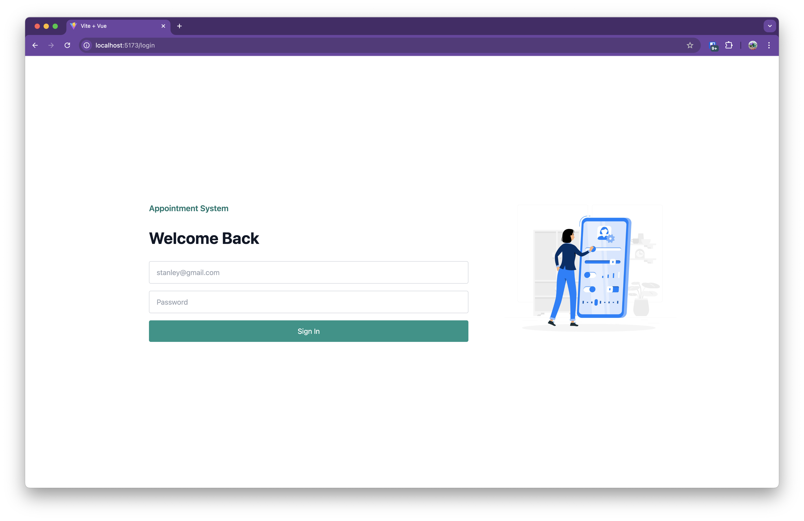
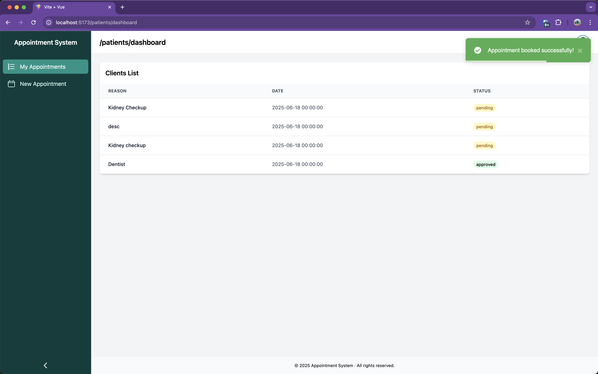
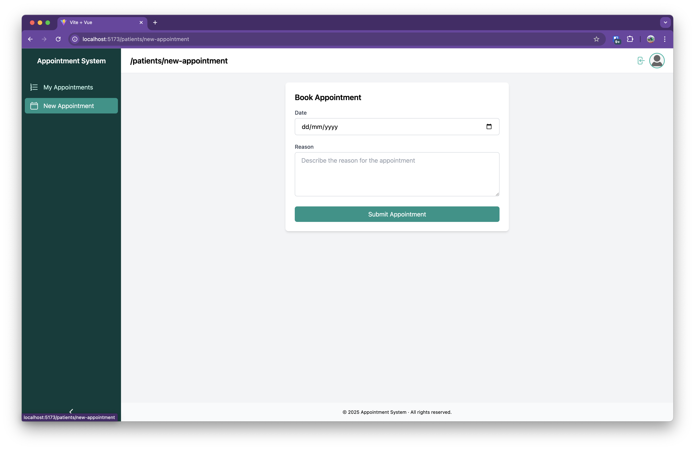
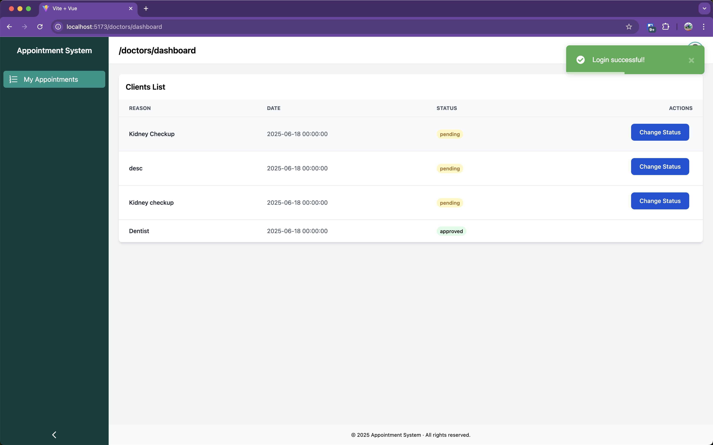
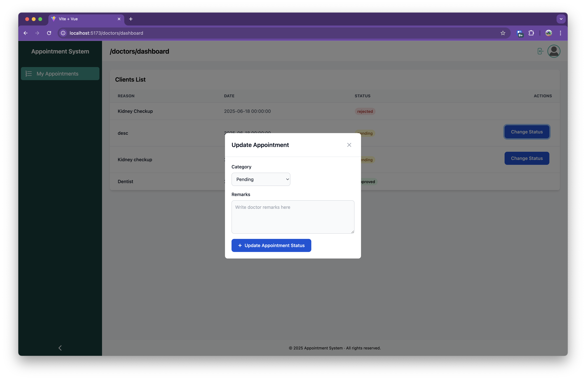

# Health Appointment Request System

A mini full-stack appointment request system built with **Laravel 12 (API)** and **Vue 3 + Vite + Tailwind CSS (SPA)**.

Patients can request health appointments. Doctors can view, approve, or reject them. The system supports authentication, role-based views, validation, and authorization.

---

##  Tech Stack

### Backend
- Laravel 12
- Sanctum (for API authentication)
- MySQL
- Laravel Policies
- Laravel Notifications (optional)
- Laravel Echo + Pusher (optional)

### Frontend
- Vue 3 (Composition API)
- Vite
- Tailwind CSS
- Vue Router
- Axios
- Pinia (optional)

---

##  Local Setup Instructions

### Prerequisites
- PHP 8.2+
- Composer
- Node.js (v16+)
- MySQL

---

### Backend (Laravel API)

1. **Clone the repo & move into backend folder**
```bash
git clone https://github.com/Cyrus-Muchiri/DoctorAppointments.git

cd DoctorAppointments/backend
```


2. **Install Dependencies and Setup environment **
```bash
composer install
cp .env.example .env
```

3. **Add db credentials**
```env
DB_CONNECTION=mysql
DB_HOST=db
DB_PORT=3306
DB_DATABASE=appointments
DB_USERNAME=root
DB_PASSWORD=root
```

4. **Laravel setup**

```bash
php artisan key:generate
php artisan migrate --seed
php artisan serve --port=8081

```


---

###  Frontend (Vue 3 SPA)

1. **Navigate to frontend folder**
```bash
cd ../frontend
```

2. **Install dependencies**
```bash
npm install
```

3. **Run the frontend dev server**
```bash
npm run dev
```

---

##  Authentication

- Uses Laravel Sanctum
- Register/Login via API
- Stores token in session storage

---

##  API Endpoints

### Auth Routes (Sanctum)
| Method | Endpoint | Description |
|--------|----------|-------------|
| POST   | `/api/register` | Register new user (patient/doctor) |
| POST   | `/api/login`    | Login and get token |
| POST   | `/api/logout`   | Logout (requires auth) |

### Appointment Request APIs

| Method | Endpoint | Description | Access |
|--------|----------|-------------|--------|
| POST   | `/api/appointments`       | Create a new appointment request | Patient |
| GET    | `/api/appointments`       | Get own requests or assigned ones | Patient / Doctor |
| PUT    | `/api/appointments/{id}`  | Approve/Reject a request | Doctor |

---

##  Roles

- **Patient**
  - Can submit appointment requests
  - Can view status updates on their requests

- **Doctor**
  - Can view assigned requests
  - Can approve/reject with remarks

---

##  Tests (Bonus)

To run feature tests (optional):

```bash
php artisan test
```

> Includes basic feature tests for appointment submission and approval.

---

##  Notifications (Bonus)

- Patients are notified via Laravel Notifications when a doctor responds.

---

## Real-Time Updates (Bonus)

- Not done. Focus was on Backend / UI and functionality

---

##  Test Users


| Role    | Email               | Password  |
|---------|---------------------|-----------|
| Patient | test@example.com    | password123  |
| Doctor  | testdoctor@example.com  | password123  |


---

##  Project Structure

```bash
health-appointment-system/
├── backend/       # Laravel API
│   ├── app/
│   ├── database/
│   └── routes/api.php
├── frontend/      # Vue 3 SPA
│   ├── src/
│   └── vite.config.js
├── db/      # has db dump for mysql init
│   ├── db-dump.sql
|── README.md
```

---

## Known Limitations

- No email verification or password reset
- No calendar/scheduling conflict checks
- Real-time updates not configured fully

---

##  License

This project is open for demonstration and assessment purposes.

---

## Screen Shots

### Login Screen



### Patients Dashboard


### Patients Create Appointment


### Doctors Dashboard


### Doctors Update Appointment Status



## Author

Built by **Cyrus Muchiri** for a technical assessment.
